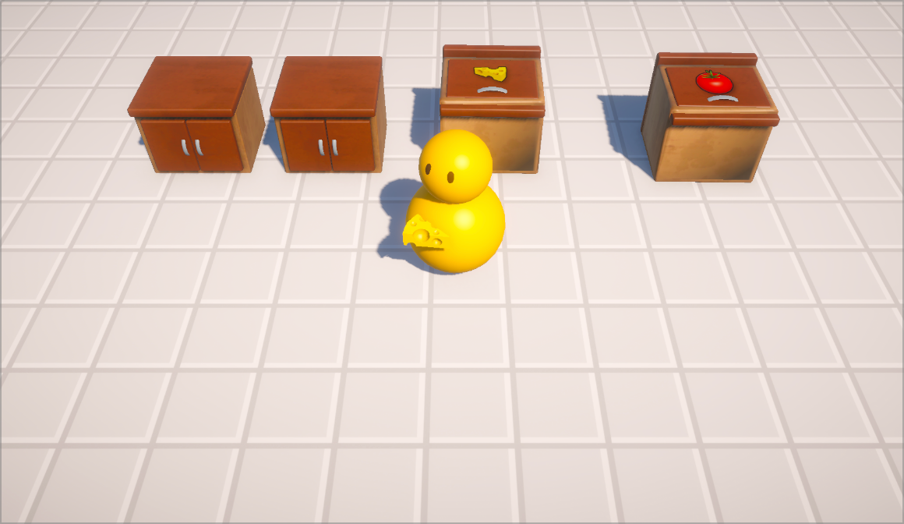
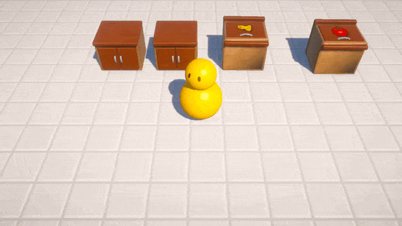

# Kitchen Game

A 3D kitchen simulation game built in Unity, following the [Kitchen Chaos](https://www.youtube.com/watch?v=AmGSEH7QcDg) tutorial series by CodeMonkey.

## Gameplay

Pick up ingredients from container counters and move them around the kitchen. Each counter interaction is handled through a clean interaction system — counters hand off kitchen objects to the player and vice versa.

## Features

- Player movement with Unity's new Input System
- Interact with counters to pick up / place kitchen objects
- Container counters that dispense specific ingredients (Tomato, CheeseBlock)
- Clear counters for staging objects
- Visual selection highlight on the nearest counter
- ScriptableObject-based ingredient definitions

## Built With

- Unity 6
- C#
- Unity Input System
